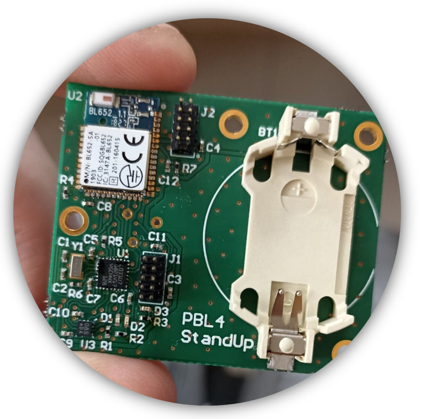
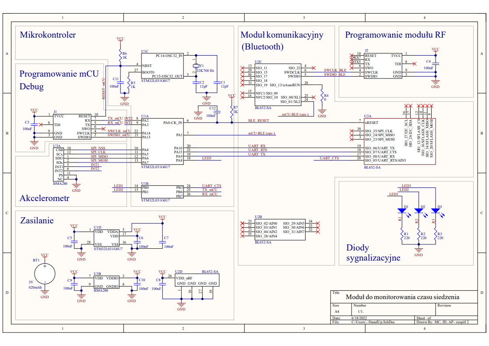
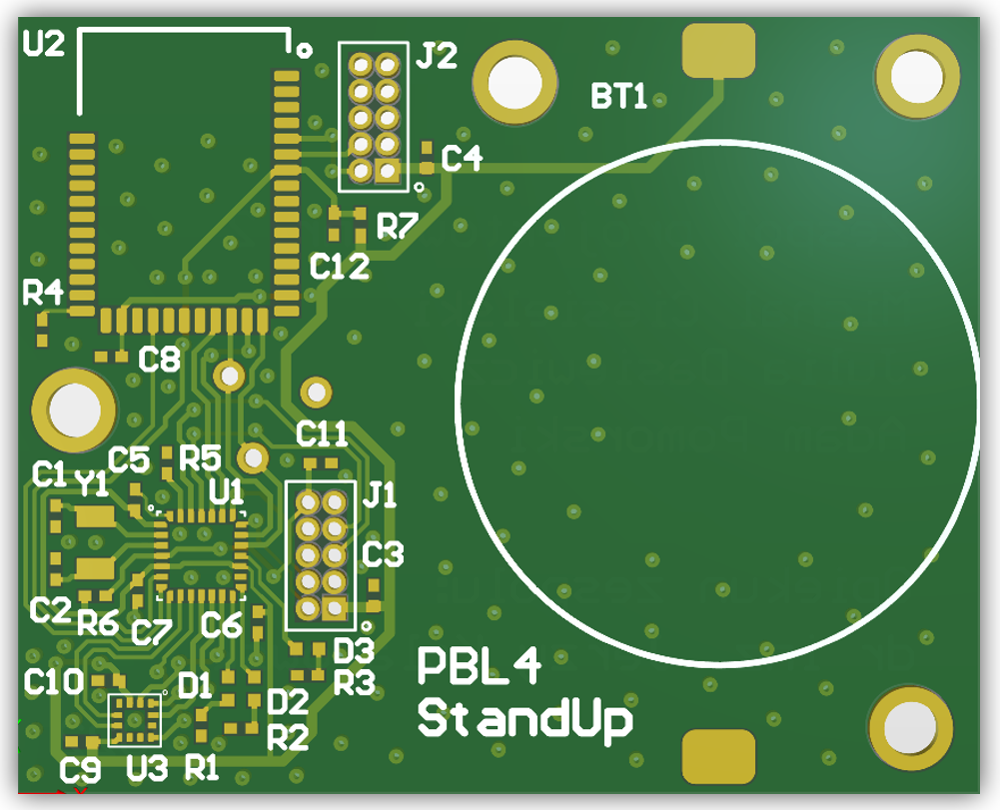

# StandUp

## Overview

StandUp is a project focused on measuring seat occupancy. It was designed to be used by elderly people to show their tendencies in longer periods of time.

It was created by Adam Pomorski, Michał Ciesielski and Julia Dasiewicz on PBL4 classes (spring 2022) as a part of the Internet of Things studies at the Warsaw University of Technology.

# Hardware

## Technology used

### Tools
- Altium Designer
- Soldering iron, soldering oven

### Parts
- microcontroller STM32L031G6U7
- accelerometer BMA280
- BLE module BL652-SA
- quartz crystal oscilator ST3215SB32768C0HPWBB
- battery CR2450
- RGB diodes

### Schematic

Schematic was created in Altium Designer and it consist of  3 main parts:
- microcontroller, mcu debugging
- BLE communication module, diodes
- power module

### PCB

# Software

## Technologies used
- C language
- STM32CubeIDE
- Segger J-Link EDU

## Code

There are 3 main modules that cover funcionalities of the device.

Code modules:

- main - main function of the program with interrupt handlers
- bma280 - custom library for BMA280 accelerometer
- mem - custom library for saving timestamps to RAM memory

Working cycle:

1. Sleeping
2. Waking up when accelerometer detects motion (by interrupt) and saving the timestamp of first motion 
3. Entering sleep mode for set number of seconds/minutes
4. Waking up and measuring accelerometer state
   - if it detects motion the cycle of entering sleep mode and waking up continues
   - if no motion is detected the timestamp is saved, ble module is powered on and both timestamps are send to ble gateway(return to point 1)

Current implementation:

Code in the repository is adjusted to a presentation of the product so that the measurements are started by the interrupt and then being made in infinte loop. It stops after no motion detected for 5 seconds. There is also no part when the device is entering the sleep mode as it was not the desired feature during a presentation. 

## Results

We created working prototype which was presented on the live presentation at the end of semester.

